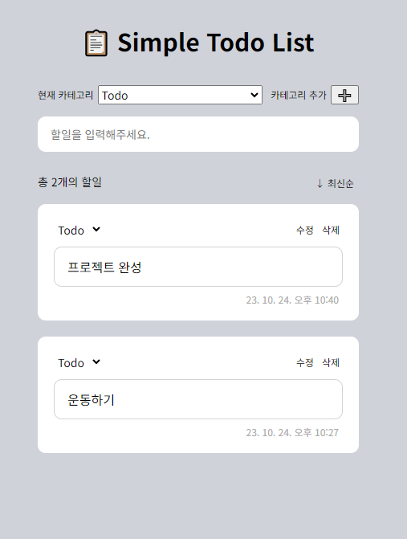
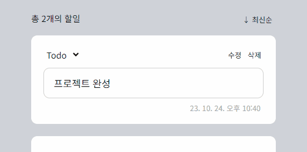

# 📋 Simple Todo List

🚀 **배포 링크**: [Simple Todo List 바로가기](https://rigood.github.io/simple-todo-list)

 

## 프로젝트 소개

상태관리 라이브러리 `recoil`의 atom, selector 개념을 익히기 위해 만든 간단한 Todo-list입니다.

- [2023.10월] 리팩토링 진행
- [2022.9월] 노마드코더 ReactJS 마스터클래스 과제 제출

 

## 주요 기능

- 진행단계에 따라 'Todo', 'Doing', 'Done' 카테고리로 분류할 수 있습니다.
- 새로운 카테고리를 추가할 수 있습니다.
- 할일을 추가, 편집, 삭제할 수 있으며, 카테고리를 이동할 수 있습니다.
- localStorage에 자동저장되며, 새로고침 해도 데이터가 유지됩니다.
- 최신순, 과거순으로 정렬할 수 있습니다.

 

## 기술 스택

- React
- TypeScript
- recoil
- recoil-persist
- react-hook-form
- styled-components

 

## 업데이트 기록

### 2023.10월

#### atom, selector를 이용하여 상태관리

##### atom

- categories atom (카테고리 목록)
- todos atom (할일 목록)
- currentCategory atom (현재 선택된 카테고리)
- isSortedByLatest atom (최신순 정렬 여부)

##### selector

- filteredTodos selector (필터링+정렬된 할일 목록): selector의 get 함수를 이용하여 todos, currentCategory, isSortedByLatest 상태값을 가져온 후, 카테고리를 기준으로 할일 목록을 필터링하고 최신순/과거순으로 정렬한 후 반환

 

#### 추가 기능 및 보완 사항

  

- input의 readOnly 속성과 onBlur 이벤트를 활용하여 **할일 수정모드** 구현

  - 수정모드 여부를 나타내는 `isEditing` state 생성
  - `readOnly`는 !isEditing으로 설정하여, 수정모드가 아닐 때는 readOnly로 작용하여 input을 클릭해도 포커스가 가지 않도록 함
  - isEditing 값을 `props`로 전달하여 수정모드 여부에 따라 스타일 지정 (border, outline, cursor 등)
  - 수정완료 버튼을 누르거나 input 바깥 영역을 클릭하면 수정모드가 종료되고 변경사항이 저장되도록 함
    - `onBlur` 이벤트를 통해 바깥영역 클릭(포커스 해제) 감지
    - (문제) 버튼을 눌렀을 떄도 onBlur 이벤트가 발생하므로, 수정완료 버튼을 누르면 onBlur 콜백함수도 실행되고 수정완료 버튼의 콜백함수도 실행됨 -> 결국 isEditing 값이 2번 바뀌므로 수정모드가 그대로 유지됨
    - (해결) onBlur 이벤트 객체에서 `relatedTarget`(클릭한 요소)를 확인하여 수정완료 버튼을 클릭했으면 onBlur 콜백함수를 실행하지 않음

- 카테고리에 따로 id를 부여하지 않았기 때문에, 동일한 카테고리가 존재하지 않도록 이미 존재하는 카테고리 이름을 입력한 경우 alert로 사용자에게 알려준 후 새로운 값을 입력하도록 함
- 할일이 없는 경우 빈 화면 대신 안내 문구 표시
- Intl.DateTimeFormat()을 사용하여 timestamp를 한국 날짜, 시간 포맷으로 변환

 

#### 잘못된 코드 수정

- (기존) select에 onInput 이벤트 달아놓고, 이벤트 타입에 FormEvent 지정해놓음, e.currentTarget.value 타입 에러에 as any 지정
- (수정) onChange 이벤트, ChangeEvent 타입으로 변경, e.target.value를 통해 선택된 option 가져옴
- `onInput & onChange`: onInput은 input 값이 입력될 때마다 발생하며, input/textarea 태그에서만 사용 가능 / onChange는 input 값이 입력된 후 포커스를 벗어날 때 발생함
- `target & currentTraget`: target은 이벤트가 처음 발생한 요소를 가리키고, currentTarget은 이벤트가 전파(캡쳐링/버블링)되어 현재 이벤트가 위치한 요소를 나타냄 -> 이벤트 전파와 관련 없어서 e.target으로 수정
